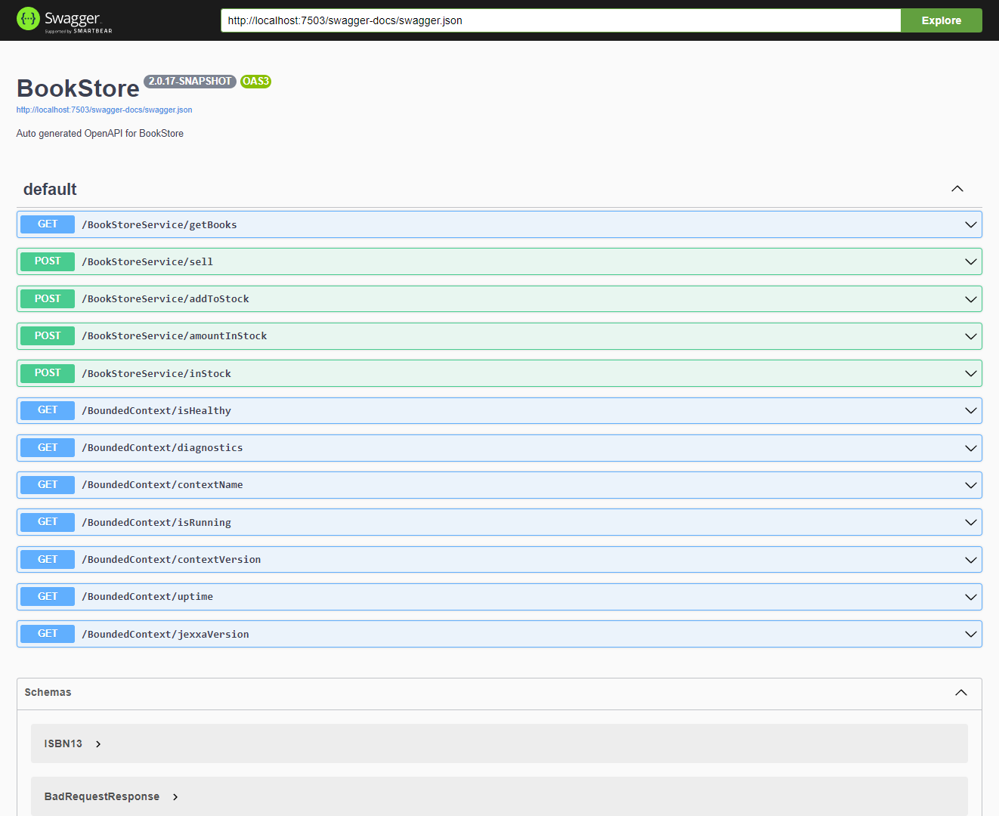

# BookStore - OpenAPI Support 

## What You Learn

*   [How to enable OpenAPI support for an application](#Enable-OpenAPI) 
*   [How to explore OpenAPI for your application](#Explore-OpenAPI)        

## What you need

*   Understand tutorial [`BookStore - Using a Repository`](README.md) because we explain only new aspects 
*   30 minutes
*   JDK 17 (or higher) installed
*   [Swagger UI](https://swagger.io/tools/swagger-ui/)    
*   Maven 3.6 (or higher) installed
*   A postgres DB (if you start the application with running infrastructure)  

## Enable OpenAPI  

In general OpenAPI support can be enabled for all objects that can be accessed via the `RESTfulRPCAdapter`. 
To enable OpenAPI support, you just need to define an OpenAPI-path either in the properties or when starting the application. 
The corresponding parameter is `io.jexxa.rest.openapi.path`.

```console                                                          
mvn clean install
java -jar "-Dio.jexxa.config.import=./src/test/resources/jexxa-test.properties" target/bookstore-jar-with-dependencies.jar```
You will see following (or similar) output
```console
...
[main] INFO io.jexxa.utils.JexxaBanner - Access Information: 
[main] INFO io.jexxa.utils.JexxaBanner - Listening on: http://0.0.0.0:7503
[main] INFO io.jexxa.utils.JexxaBanner - OpenAPI available at: http://0.0.0.0:7503/swagger-docs/swagger.json


```          

## Explore OpenAPI

You can use [Swagger UI](https://swagger.io/tools/swagger-ui/) to explore the documentation. Just start Swagger UI, enter the URL and press explore button. 

Note: In case you start Swagger UI not on the same machine as your BookStore-application, or from a docker image you have to use the public IP address of the machine running BookStore-application. 

As result, you should get following overview with available operations: 

 

Now, lets start execute some methods.
       
### Get list of books

To get a list of available books, you first have to select the corresponding methods. As soon as you pressed it, you will get detailed information such as including parameters and responses. 

 

Now, you can execute the method `getBooks` and Swagger-UI will show you all available books. 

 

From these results you can play around with remaining methods provided by this application. 

That’s it! 
